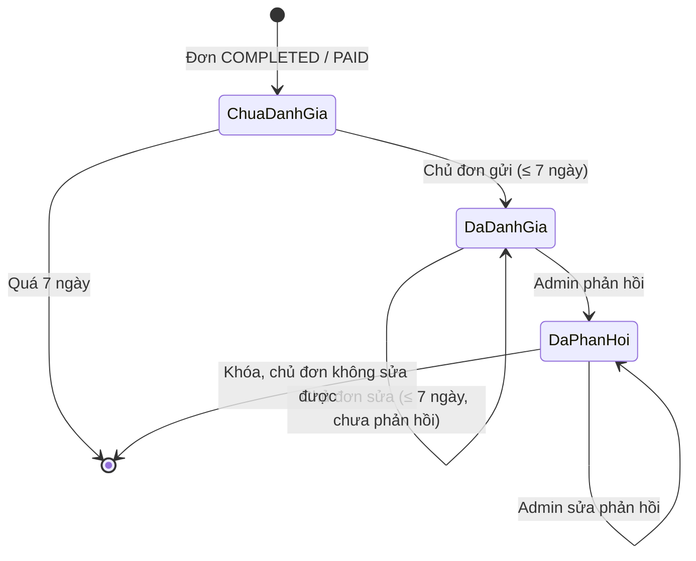
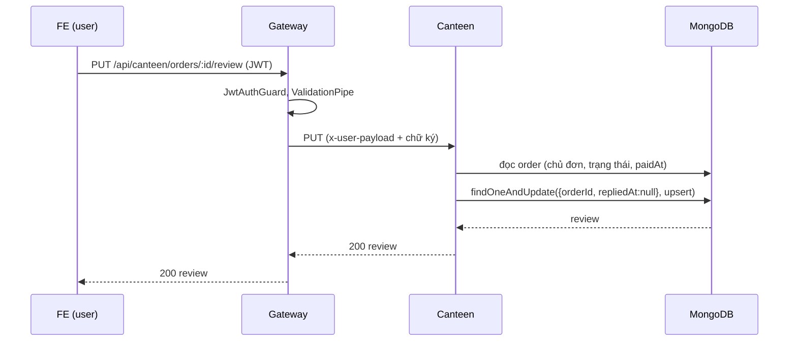

# Tài liệu nghiệp vụ (BA) — Đánh giá & phản hồi đơn căn tin

| Mục | Nội dung |
| --- | --- |
| Tính năng | Đánh giá bữa ăn sau thanh toán và phản hồi của căn tin |
| Dịch vụ | Canteen (`backend/canteen`), Gateway (`backend/gateway`), FE (`Nrapp`) |
| Trạng thái | Đã phát triển ở nhánh `feature/canteen-order-feedback` |
| Người đọc | BA, dev BE/FE, QA, người quản lý căn tin |

## 1. Bối cảnh và vấn đề

Căn tin NRApp phục vụ nhân viên theo mô hình **gọi món tại bàn, thanh toán tiền
mặt**. Vòng đời một đơn hiện tại là:

```text
CREATED / PENDING  ──admin thu tiền mặt──▶  COMPLETED / PAID
        └────────── hủy (chưa thanh toán) ──▶  CANCELLED
```

Sau khi đơn `COMPLETED`, hệ thống **không còn kênh nào** để nhân viên nói món
ngon hay dở, phục vụ nhanh hay chậm. Người quản lý căn tin chỉ biết số đơn và
số tiền, không có tín hiệu chất lượng nào để điều chỉnh thực đơn hay cách phục vụ.

Phạm vi căn tin đã được thu gọn có chủ đích: bếp, kho, nguyên liệu, thống kê,
giảm giá, thanh toán QR và hoàn tiền đã bị gỡ (xem `README.md` và test hợp đồng
của Gateway). Vì vậy tính năng này **không** đưa các phần đó trở lại; nó chỉ đọc
dữ liệu đơn hàng đã có và thêm một collection độc lập `reviews`.

## 2. Mục tiêu và chỉ số thành công

| Mã | Mục tiêu | Cách đo |
| --- | --- | --- |
| G-01 | Nhân viên gửi được đánh giá trong vài thao tác sau khi trả tiền | Đánh giá cần tối đa: chạm số sao → (nhận xét) → gửi |
| G-02 | Quản lý nắm được mức hài lòng chung và phân bố theo sao | Màn thống kê: điểm trung bình, số lượng từng mức sao |
| G-03 | Không bỏ sót phản hồi tiêu cực | Bộ lọc "Chưa phản hồi" và lọc theo số sao |
| G-04 | Nhân viên thấy căn tin đã ghi nhận ý kiến | Phản hồi của admin hiển thị ngay trong đơn của nhân viên |
| G-05 | Dữ liệu đánh giá tin cậy | Chỉ chủ đơn đã thanh toán được đánh giá; mỗi đơn một đánh giá |

## 3. Phạm vi

**Trong phạm vi**

- Chủ đơn đánh giá 1–5 sao kèm nhận xét tùy chọn cho **cả đơn**.
- Chủ đơn sửa đánh giá trong thời hạn, chừng nào chưa được phản hồi.
- Admin xem danh sách, lọc, xem thống kê và phản hồi (có thể sửa phản hồi).
- Nhân viên xem lại đánh giá của mình và phản hồi nhận được.

**Ngoài phạm vi** (có chủ đích, ghi để tránh hiểu nhầm)

- Đánh giá riêng từng món; xếp hạng món trên thực đơn công khai.
- Xóa hoặc ẩn đánh giá (kiểm duyệt nội dung); báo cáo vi phạm.
- Thông báo đẩy khi có phản hồi (nhân viên thấy khi mở/làm mới màn hình).
- Đánh giá ẩn danh; đánh giá đơn đã hủy hoặc chưa thanh toán.
- Xuất báo cáo, biểu đồ theo thời gian, cảnh báo tự động.

## 4. Tác nhân và quyền

| Tác nhân | Mô tả | Quyền trong tính năng |
| --- | --- | --- |
| Nhân viên (`USER`) | Người đặt món | Đánh giá/sửa đánh giá **đơn của mình**; xem đánh giá của mình |
| Quản trị căn tin (`ADMIN`) | Người thu tiền, quản lý căn tin | Xem danh sách, thống kê; phản hồi/sửa phản hồi. Là chủ đơn thì cũng đánh giá được đơn của mình như nhân viên |
| Gateway | Xác thực JWT, ký danh tính chuyển cho Canteen | Chuyển tiếp, kiểm tra vai trò thô |
| Canteen service | Chủ sở hữu dữ liệu | Quyết định cuối cùng về mọi quy tắc nghiệp vụ |

Canteen chỉ nhận hai vai trò `ADMIN` và `USER` (giống phần còn lại của service).
Các vai trò khác ở Gateway (`MANAGER`, `CASHIER`…) không có quyền riêng ở đây.

| Thao tác | USER (chủ đơn) | USER (không phải chủ đơn) | ADMIN |
| --- | :---: | :---: | :---: |
| Tạo/sửa đánh giá của một đơn | Có | Không (403) | Chỉ khi là chủ đơn |
| Xem đánh giá của mình | Có | — | Có (của mình) |
| Xem danh sách / thống kê toàn bộ | Không (403) | Không (403) | Có |
| Phản hồi đánh giá | Không (403) | Không (403) | Có |

## 5. Yêu cầu nghiệp vụ (User story)

| Mã | Với vai trò | Tôi muốn | Để | Ưu tiên |
| --- | --- | --- | --- | --- |
| US-01 | Nhân viên | chấm 1–5 sao cho đơn đã thanh toán | phản ánh mức hài lòng | Cao |
| US-02 | Nhân viên | viết thêm nhận xét ngắn | nói rõ lý do | Trung bình |
| US-03 | Nhân viên | sửa đánh giá khi còn trong thời hạn | chỉnh lại nếu đánh giá vội | Trung bình |
| US-04 | Nhân viên | xem đánh giá và phản hồi của căn tin | biết ý kiến đã được tiếp nhận | Cao |
| US-05 | Admin | xem điểm trung bình, phân bố sao, số chưa phản hồi | nắm chất lượng nhanh | Cao |
| US-06 | Admin | lọc theo sao, trạng thái phản hồi, khoảng thời gian | tập trung vào đánh giá thấp/chưa xử lý | Cao |
| US-07 | Admin | phản hồi và sửa phản hồi | thể hiện căn tin lắng nghe và xử lý | Cao |
| US-08 | Admin | thấy mã đơn và tên các món trong đánh giá | biết đánh giá nói về bữa nào | Trung bình |

## 6. Quy tắc nghiệp vụ

| Mã | Quy tắc | Nơi thực thi |
| --- | --- | --- |
| BR-01 | Chỉ **chủ đơn** được tạo/sửa đánh giá của đơn đó; admin không đánh giá thay người khác | Canteen `ReviewService` (403) |
| BR-02 | Chỉ đơn **`status = COMPLETED` và `paymentStatus = PAID`** được đánh giá; đơn mới tạo, chờ thu tiền hoặc đã hủy thì không | Canteen (409) |
| BR-03 | Thời hạn **7 ngày** tính từ `paidAt` (đơn cũ không có `paidAt` thì dùng `updatedAt`); quá hạn không tạo mới cũng không sửa được | Canteen (409); FE ẩn form theo cùng quy tắc |
| BR-04 | Mỗi đơn có **tối đa một** đánh giá; gửi lại cho cùng đơn là **sửa** đánh giá cũ | Unique index `orderId` |
| BR-05 | Số sao là **số nguyên 1–5**; nhận xét tối đa **500 ký tự**, được cắt khoảng trắng đầu/cuối; nhận xét rỗng nghĩa là không có nhận xét (sửa thành rỗng sẽ xóa nhận xét cũ) | DTO + Service |
| BR-06 | Khi căn tin đã **phản hồi**, đánh giá bị **khóa**: chủ đơn không sửa được nữa | Canteen (409) |
| BR-07 | Phản hồi bắt buộc có nội dung (sau khi cắt khoảng trắng), tối đa 500 ký tự; admin được **sửa** phản hồi bất kỳ lúc nào; mỗi lần ghi lại `repliedAt`, `repliedBy` | DTO + Service |
| BR-08 | Danh sách và thống kê toàn bộ chỉ dành cho admin; nhân viên chỉ thấy đánh giá của chính mình | `@Roles(ADMIN)` / `@Authenticated()` |
| BR-09 | Không xóa đánh giá (giữ nguyên làm bằng chứng/lịch sử) | Không có API xóa |
| BR-10 | Đánh giá lưu **bản sao** mã đơn và tên món tại lúc tạo để vẫn đọc được khi món bị sửa/xóa | Schema `Review` |
| BR-11 | Khoảng lọc thời gian dựa trên **thời điểm tạo đánh giá**; `from` không được sau `to` | Canteen (400) |

## 7. Vòng đời đánh giá



| Trạng thái | Điều kiện dữ liệu | Chủ đơn làm được | Admin làm được |
| --- | --- | --- | --- |
| Chưa đánh giá | Chưa có bản ghi `reviews` cho đơn | Gửi đánh giá nếu còn hạn | — |
| Đã đánh giá | Có bản ghi, `repliedAt = null` | Sửa nếu còn hạn | Phản hồi |
| Đã phản hồi | `repliedAt` có giá trị | Chỉ xem | Sửa phản hồi |

## 8. Luồng nghiệp vụ chi tiết (Use case)

### UC-01 — Nhân viên đánh giá đơn

- **Tiền điều kiện:** đã đăng nhập; đơn của mình ở trạng thái `COMPLETED/PAID`; còn trong 7 ngày kể từ lúc thu tiền.
- **Luồng chính:**
  1. Nhân viên mở **Căn tin → Đơn của tôi**; đơn đã thanh toán hiển thị khối "Bạn thấy bữa ăn thế nào?".
  2. Chạm số sao (bắt buộc), nhập nhận xét (tùy chọn), bấm **Gửi đánh giá**.
  3. FE gọi `PUT /canteen/orders/:id/review`.
  4. Hệ thống kiểm tra BR-01…BR-06, lưu đánh giá cùng bản sao mã đơn và tên món.
  5. FE hiển thị đánh giá vừa lưu (số sao, nhận xét) và thông báo cảm ơn.
- **Luồng thay thế:**
  - A1 — Chưa chọn sao: FE nhắc "Chưa chọn số sao", không gọi API.
  - A2 — Quá 7 ngày: server trả 409; FE không hiện form với đơn quá hạn chưa có đánh giá.
  - A3 — Đã được phản hồi: server trả 409 "không thể chỉnh sửa"; FE đồng bộ lại danh sách.
  - A4 — Đơn không phải của mình hoặc chưa thanh toán: 403 / 409.
- **Hậu điều kiện:** có đúng một bản ghi `reviews` cho đơn.

### UC-02 — Nhân viên sửa đánh giá

- **Tiền điều kiện:** đã có đánh giá, còn trong 7 ngày, chưa có phản hồi.
- **Luồng chính:** bấm **Sửa đánh giá** → đổi sao/nhận xét → **Gửi đánh giá** → `PUT` cùng endpoint, bản ghi cũ được cập nhật (không tạo bản mới).
- **Ghi chú:** nếu admin phản hồi trong lúc đang sửa, thao tác lưu bị từ chối (409) nhờ điều kiện ghi nguyên tử (mục 11.3).

### UC-03 — Admin xem thống kê và danh sách

- **Tiền điều kiện:** vai trò `ADMIN`.
- **Luồng chính:** **Căn tin (quản lý) → tab Đánh giá**: hệ thống tải song song thống kê (`GET /reviews/summary`) và danh sách (`GET /reviews`); admin đổi bộ lọc *thời gian* (Tất cả / 7 ngày / 30 ngày), *số sao*, *trạng thái phản hồi*; danh sách phân trang 10 mục/trang, mới nhất trước.
- **Hậu điều kiện:** không thay đổi dữ liệu.

### UC-04 — Admin phản hồi đánh giá

- **Luồng chính:** trên thẻ đánh giá, nhập nội dung → **Gửi phản hồi** → `PATCH /reviews/:id/reply`; thống kê "chưa phản hồi" giảm 1; nhân viên thấy phản hồi trong đơn của mình ở lần tải/làm mới tiếp theo.
- **Sửa phản hồi:** bấm **Sửa phản hồi** (ô nhập được điền sẵn nội dung cũ) → gửi lại; ghi đè phản hồi cũ.
- **Luồng thay thế:** nội dung rỗng → FE nhắc, server cũng trả 422; đánh giá không tồn tại → 404.

## 9. Mô hình dữ liệu

Collection MongoDB **`reviews`** (database dùng chung `nrapp_dev`), schema tại `backend/canteen/src/schemas/reviews.schema.ts`.

| Trường | Kiểu | Bắt buộc | Ghi chú |
| --- | --- | :---: | --- |
| `_id` | ObjectId | Có | |
| `orderId` | ObjectId → `orders` | Có | Duy nhất (BR-04) |
| `orderNumber` | string | Có | Bản sao, ví dụ `#1042` (BR-10) |
| `userId` | ObjectId | Có | Chủ đơn |
| `itemNames` | string[] | Có | Bản sao tên món (BR-10) |
| `rating` | int 1–5 | Có | |
| `comment` | string ≤ 500 | Không | Không lưu chuỗi rỗng |
| `replyMessage` | string ≤ 500 | Không | Phản hồi của căn tin |
| `repliedAt` | Date \| null | Không | `null`/vắng = chưa phản hồi |
| `repliedBy` | ObjectId | Không | Admin phản hồi gần nhất |
| `createdAt`, `updatedAt` | Date | Tự động | |

**Index** (đã ghi trong [database-indexes.md](database-indexes.md))

| Index | Phục vụ |
| --- | --- |
| `{ orderId: 1 }` **unique** | Một đánh giá/đơn; điều kiện upsert; chống ghi đè khi đã phản hồi |
| `{ createdAt: -1, _id: -1 }` | Danh sách admin, khoảng thời gian, phân trang ổn định |
| `{ rating: 1, createdAt: -1, _id: -1 }` | Lọc theo sao |
| `{ repliedAt: 1, createdAt: -1, _id: -1 }` | Lọc chưa/đã phản hồi, đếm chưa phản hồi |
| `{ userId: 1, createdAt: -1, _id: -1 }` | Đánh giá của tôi |

**Tương thích dữ liệu cũ:** không đổi schema `orders`; không cần migration. Service
tự tạo collection và index khi chạy (Mongoose `autoIndex`).

## 10. Đặc tả API

Tất cả route nằm dưới `/api/canteen`, đi qua Gateway (`/api/canteen/...`; FE gọi
`/canteen/...` với `ipNR` đã có `/api`). Mọi route cần JWT.

| Route | Quyền | Mục đích |
| --- | --- | --- |
| `PUT /orders/:id/review` | Chủ đơn | Tạo hoặc sửa đánh giá |
| `GET /reviews/my` | Đã xác thực | Đánh giá của tôi (tối đa 200, mới nhất trước) |
| `GET /reviews` | Admin | Danh sách có lọc, phân trang |
| `GET /reviews/summary` | Admin | Thống kê |
| `PATCH /reviews/:id/reply` | Admin | Phản hồi / sửa phản hồi |

### 10.1 `PUT /orders/:id/review`

Yêu cầu:

```json
{ "rating": 4, "comment": "Cơm ngon, lên món hơi chậm" }
```

Phản hồi `200` — đối tượng đánh giá:

```json
{
  "_id": "6702a1f0c3d4e5f607182930",
  "orderId": "6702a0b1c3d4e5f607182911",
  "orderNumber": "#1042",
  "userId": "66f1...",
  "itemNames": ["Cơm tấm sườn", "Trà đá"],
  "rating": 4,
  "comment": "Cơm ngon, lên món hơi chậm",
  "repliedAt": null,
  "createdAt": "2026-10-05T04:10:00.000Z",
  "updatedAt": "2026-10-05T04:10:00.000Z"
}
```

| Mã | Khi nào |
| --- | --- |
| 400 | `:id` không phải ObjectId |
| 401 | Thiếu/sai danh tính |
| 403 | Không phải chủ đơn |
| 404 | Đơn không tồn tại |
| 409 | Đơn chưa thanh toán xong / quá 7 ngày / đã được phản hồi |
| 422 | `rating` ngoài 1–5 hoặc không nguyên; nhận xét > 500 ký tự |

### 10.2 `GET /reviews`

Query (tùy chọn): `rating` (1–5), `replied` (`true`/`false`), `from`, `to` (ISO 8601), `page` (≥1, mặc định 1), `limit` (1–100, mặc định 20).

```json
{
  "reviews": [ { "...": "như 10.1" } ],
  "pagination": { "page": 1, "limit": 20, "total": 37, "totalPages": 2 }
}
```

Lỗi: `400` khi `from > to`; `403` nếu không phải admin; `422` khi tham số sai kiểu.

### 10.3 `GET /reviews/summary`

Query: `from`, `to` (tùy chọn).

```json
{
  "total": 37,
  "averageRating": 4.19,
  "distribution": { "1": 1, "2": 2, "3": 4, "4": 12, "5": 18 },
  "unanswered": 9
}
```

`averageRating` làm tròn 2 chữ số, bằng `0` khi chưa có đánh giá. `distribution` luôn đủ năm mức.
Số liệu trên cùng khoảng thời gian với bộ lọc `from`/`to`.

### 10.4 `PATCH /reviews/:id/reply`

```json
{ "message": "Cảm ơn bạn, căn tin sẽ chuẩn bị món nhanh hơn." }
```

`200` trả đánh giá đã cập nhật (`replyMessage`, `repliedAt`, `repliedBy`). Lỗi: `400` id sai; `403` không phải admin; `404` không có đánh giá; `422` nội dung rỗng/quá dài.

## 11. Thiết kế kỹ thuật cần biết

### 11.1 Thành phần

| Lớp | Tệp chính |
| --- | --- |
| Canteen | `src/modules/review/{review.module,review.controller,review.service}.ts`, `dto/*`, `src/schemas/reviews.schema.ts` |
| Gateway | `src/modules/canteen/canteen.controller.ts` & `canteen.service.ts` (nhóm Review), `dto/{upsert-review,reply-review,review-query}.dto.ts` |
| FE service | `Nrapp/src/services/canteen/review.service.ts` |
| FE user | `features/canteen/user/ui/OrderReviewPanel.tsx`, `UserStarRating.tsx`; tích hợp trong `UserCanteenScreen.tsx` |
| FE admin | `features/canteen/admin/ui/AdminReviewManager.tsx`, `AdminStarRating.tsx`; tab "Đánh giá" trong `AdminCanteenScreen.tsx` |

Giao diện admin và user được tách riêng đúng quy ước ESLint của FE (không dùng chung UI trong `shared`).

### 11.2 Luồng gọi



### 11.3 Tính nhất quán và đồng thời

- **Một đánh giá/đơn:** unique index `orderId`.
- **Chống ghi đè phản hồi:** thao tác lưu dùng `findOneAndUpdate` với bộ lọc `{ orderId, repliedAt: null }` và `upsert`. Nếu admin vừa phản hồi, bộ lọc không khớp, upsert cố tạo bản ghi mới và vi phạm unique → service đổi lỗi trùng khóa (`11000`) thành `409`. Không cần transaction.
- **Hai lần gửi liên tiếp (chạm đúp):** cùng một bản ghi được ghi đè, kết quả như một lần.
- **Ghi đè phản hồi của admin:** admin cập nhật bằng `findByIdAndUpdate`, lần ghi sau cùng thắng.

### 11.4 Hằng số cần đồng bộ

Thời hạn 7 ngày nằm ở **hai nơi**: `REVIEW_WINDOW_DAYS` trong `review.service.ts` (nguồn quyết định) và trong `Nrapp/src/services/canteen/review.service.ts` (chỉ để ẩn/hiện form). Đổi thời hạn thì sửa cả hai.

## 12. Giao diện

**Nhân viên — Căn tin → Đơn của tôi** (đơn `COMPLETED/PAID`):

| Tình huống | Hiển thị |
| --- | --- |
| Chưa đánh giá, còn hạn | Năm sao chạm được, ô nhận xét, nút **Gửi đánh giá**, ghi chú về thời hạn |
| Chưa đánh giá, quá hạn | Không hiển thị gì |
| Đã đánh giá, chưa phản hồi, còn hạn | Sao + nhận xét + nút **Sửa đánh giá** |
| Đã đánh giá, hết hạn hoặc đã phản hồi | Sao + nhận xét (chỉ xem) |
| Có phản hồi | Khối xanh "Căn tin phản hồi" |

**Admin — Căn tin (quản lý) → tab Đánh giá:** thẻ thống kê (điểm trung bình, số đánh giá, thanh phân bố 5→1 sao, số chưa phản hồi); chip lọc thời gian / số sao / trạng thái phản hồi; danh sách thẻ đánh giá (mã đơn, giờ, sao, các món, nhận xét, khung phản hồi); phân trang. Làm mới màn hình tải lại cả thống kê và danh sách.

## 13. Yêu cầu phi chức năng

| Nhóm | Yêu cầu | Cách đáp ứng |
| --- | --- | --- |
| Bảo mật | Không tin dữ liệu từ client | Chủ đơn/trạng thái/hạn kiểm tra lại ở Canteen từ dữ liệu đơn trong DB; Canteen xác minh chữ ký danh tính do Gateway ký |
| Riêng tư | Nhân viên không đọc đánh giá của người khác | `GET /reviews*` chỉ admin; `/reviews/my` lọc theo `userId` từ danh tính |
| Hiệu năng | Danh sách/thống kê không quét toàn collection | Các index ở mục 9; phân trang `limit ≤ 100` |
| Toàn vẹn | Không có hai đánh giá cho một đơn | Unique index |
| Quan sát | Lỗi được ghi log kèm request id | Dùng `GlobalExceptionFilter` và request-id sẵn có |
| Tương thích | Không phá vỡ API và dữ liệu cũ | Chỉ thêm route/collection; test hợp đồng Gateway "không có API bếp/kho" vẫn đúng |

## 14. Tiêu chí nghiệm thu

| Mã | Tiêu chí | Liên quan |
| --- | --- | --- |
| AC-01 | Chủ đơn `COMPLETED/PAID` trong 7 ngày gửi được 1–5 sao; bản ghi lưu `orderNumber`, `itemNames` | BR-01–03, 10 |
| AC-02 | Đơn `CREATED`, `CANCELLED` hoặc `COMPLETED` nhưng `PENDING` bị từ chối 409 | BR-02 |
| AC-03 | Đơn thanh toán quá 7 ngày bị từ chối 409, kể cả đơn cũ chưa có `paidAt` | BR-03 |
| AC-04 | Người khác (kể cả admin) đánh giá đơn không phải của mình bị 403 | BR-01 |
| AC-05 | Gửi lại cho cùng đơn cập nhật bản ghi cũ, không tạo thêm; nhận xét để trống thì xóa nhận xét cũ | BR-04, 05 |
| AC-06 | `rating` 0, 6, 3.5, chuỗi; nhận xét > 500 ký tự bị 422 | BR-05 |
| AC-07 | Sau khi admin phản hồi, chủ đơn sửa bị 409 | BR-06 |
| AC-08 | Phản hồi rỗng/chỉ khoảng trắng bị 422; admin sửa được phản hồi | BR-07 |
| AC-09 | Nhân viên không gọi được `GET /reviews`, `/reviews/summary`, `PATCH .../reply` (403) | BR-08 |
| AC-10 | Thống kê đúng: trung bình, phân bố đủ 5 mức, chưa phản hồi; rỗng thì `0` | US-05 |
| AC-11 | Lọc theo sao, trạng thái phản hồi, khoảng thời gian cho kết quả đúng; `from > to` bị 400 | US-06, BR-11 |
| AC-12 | Nhân viên thấy phản hồi của căn tin trong "Đơn của tôi" sau khi làm mới | US-04 |

### Kiểm thử tự động đã có

| Tệp | Nội dung |
| --- | --- |
| `backend/canteen/src/modules/review/review.service.spec.ts` | Quy tắc BR-01…BR-07, BR-11; truy vấn, thống kê; kiểm tra DTO |
| `backend/canteen/src/modules/review/review-routes.contract.spec.ts` | Năm route, phương thức, phân quyền |
| `backend/gateway/src/modules/canteen/review.contract.test.ts` | DTO Gateway, phân quyền route, chuyển tiếp có chữ ký |

Chạy: `npm --prefix backend/canteen test -- --runInBand` và `npm --prefix backend/gateway test`.
Kiểm tra tĩnh: `npm run lint` và `tsc --noEmit` ở `backend/canteen`, `backend/gateway`; `npm run lint` và `npm run typecheck` ở `Nrapp`.

### Kiểm thử thủ công gợi ý (UAT)

Chạy nhóm dịch vụ `gateway,auth,user,mail,canteen` và FE:

1. Tạo đơn bằng tài khoản A → admin thu tiền mặt → A thấy khối đánh giá ở "Đơn của tôi" (AC-01).
2. A gửi 4 sao + nhận xét → sửa thành 5 sao, xóa nhận xét (AC-05).
3. Admin mở tab Đánh giá: thấy 1 đánh giá, "1 chưa phản hồi" → phản hồi (AC-08, AC-10).
4. A làm mới: thấy phản hồi, không còn nút sửa (AC-07, AC-12).
5. Tạo đơn khác nhưng chưa thu tiền: không có khối đánh giá (AC-02).
6. Sửa thủ công `paidAt` của một đơn lùi hơn 7 ngày trong Data Explorer: form biến mất, gọi API trực tiếp nhận 409 (AC-03).

## 15. Rủi ro, giả định và hạn chế

| # | Nội dung | Hướng xử lý |
| --- | --- | --- |
| 1 | Đánh giá theo **cả đơn**, chưa biết món nào bị chê | `itemNames` giúp đọc ngữ cảnh; đánh giá theo món là hướng mở rộng |
| 2 | Chưa có kiểm duyệt: nhận xét xúc phạm vẫn hiển thị cho admin | Có thể thêm cờ ẩn/báo cáo sau |
| 3 | Chưa có thông báo đẩy khi có phản hồi | Hiện thấy khi mở/làm mới màn "Đơn của tôi" |
| 4 | Thời hạn 7 ngày cố định trong code ở hai nơi | Đổi hằng số ở cả BE và FE; có thể chuyển sang cấu hình env nếu cần |
| 5 | `GET /reviews/my` giới hạn 200 bản ghi mới nhất | Đơn quá hạn không đánh giá lại được nên chỉ ảnh hưởng hiển thị đánh giá rất cũ |
| 6 | Thống kê theo ngày **tạo đánh giá**, không theo ngày ăn | Gần nhau vì đánh giá thường diễn ra ngay sau khi thanh toán |
| 7 | Nhiều admin có thể cùng phản hồi một đánh giá; lần ghi sau cùng thắng | `repliedBy` ghi nhận người phản hồi gần nhất |
| 8 | Tải thống kê dùng aggregate trên toàn khoảng lọc | Phù hợp quy mô căn tin nội bộ; theo dõi nếu số đánh giá lên hàng trăm nghìn |
| 9 | Chưa chạy `npm run check:indexes` cho index mới (cần Docker) | Chạy trước khi triển khai; script hiện chưa có kịch bản riêng cho `reviews` |

## 16. Hướng mở rộng

- Đánh giá từng món và hiển thị điểm trên thực đơn.
- Thông báo đẩy/tin nhắn khi căn tin phản hồi.
- Cờ "cần xử lý" cho đánh giá ≤ 2 sao chưa phản hồi; xuất báo cáo định kỳ.
- Kiểm duyệt nhận xét; cấu hình thời hạn đánh giá qua biến môi trường.
